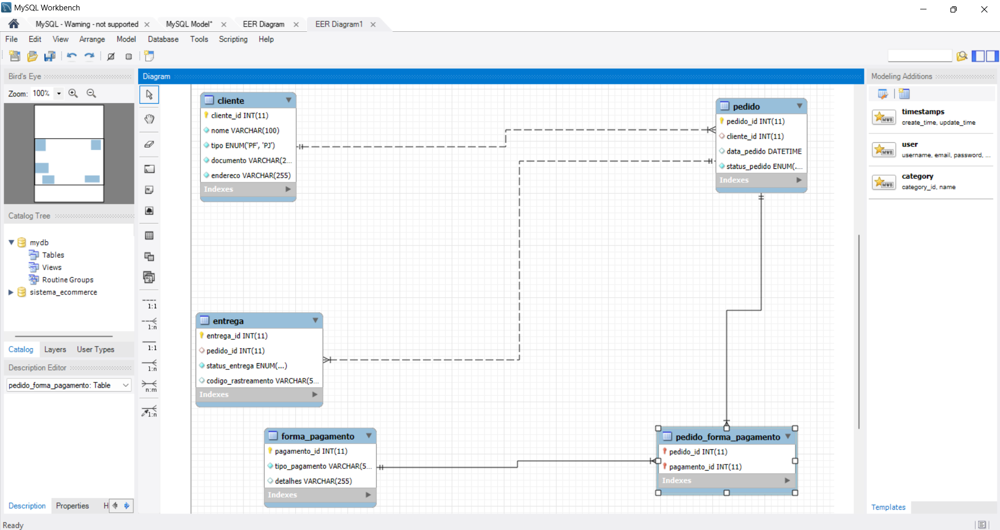

# Sistema de Gerenciamento de Clientes e Pedidos

## Descrição do Projeto
Este projeto visa desenvolver um sistema de gerenciamento para uma plataforma de e-commerce, onde o foco principal é gerenciar as informações de clientes, pedidos e formas de pagamento. O modelo conceitual garante que um cliente pode ser uma pessoa jurídica (PJ) ou uma pessoa física (PF), mas não pode ser ambas. O sistema permite o cadastro de múltiplas formas de pagamento e gerencia o status de entrega dos pedidos, incluindo informações de rastreamento.

## Estrutura do Banco de Dados
### Entidades
1. **Cliente**
   - cliente_id (PK)
   - nome
   - tipo (PJ ou PF)
   - documento (CNPJ para PJ, CPF para PF)
   - endereco

2. **Pedido**
   - pedido_id (PK)
   - cliente_id (FK)
   - data_pedido
   - status_pedido (ex: Em processamento, Enviado, Entregue)

3. **Forma de Pagamento**
   - pagamento_id (PK)
   - tipo_pagamento (ex: Cartão de Crédito, Boleto, Transferência)
   - detalhes (informações adicionais sobre a forma de pagamento)

4. **Entrega**
   - entrega_id (PK)
   - pedido_id (FK)
   - status_entrega (ex: Pendente, Em trânsito, Entregue)
   - codigo_rastreamento

### Relacionamentos
- Um cliente pode fazer vários pedidos (1:N).
- Um pedido pode ter várias formas de pagamento (N:M).
- Cada pedido tem uma entrega associada (1:1).

## Diagrama ER

## Executar o Projeto
Para executar o projeto, importe o arquivo `modelo.sql` no seu banco de dados e siga as instruções de uso na documentação técnica.

## Documentação Técnica
Veja o arquivo `docs/documentacao_tecnica.md` para mais detalhes sobre a implementação e utilização do sistema.
